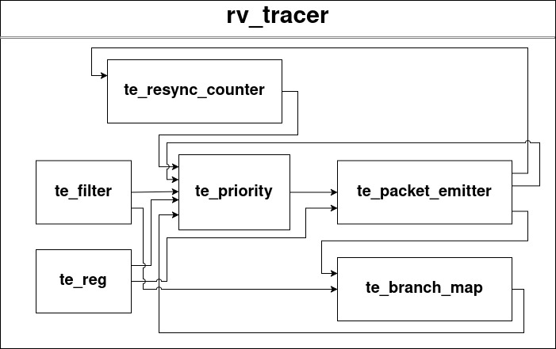
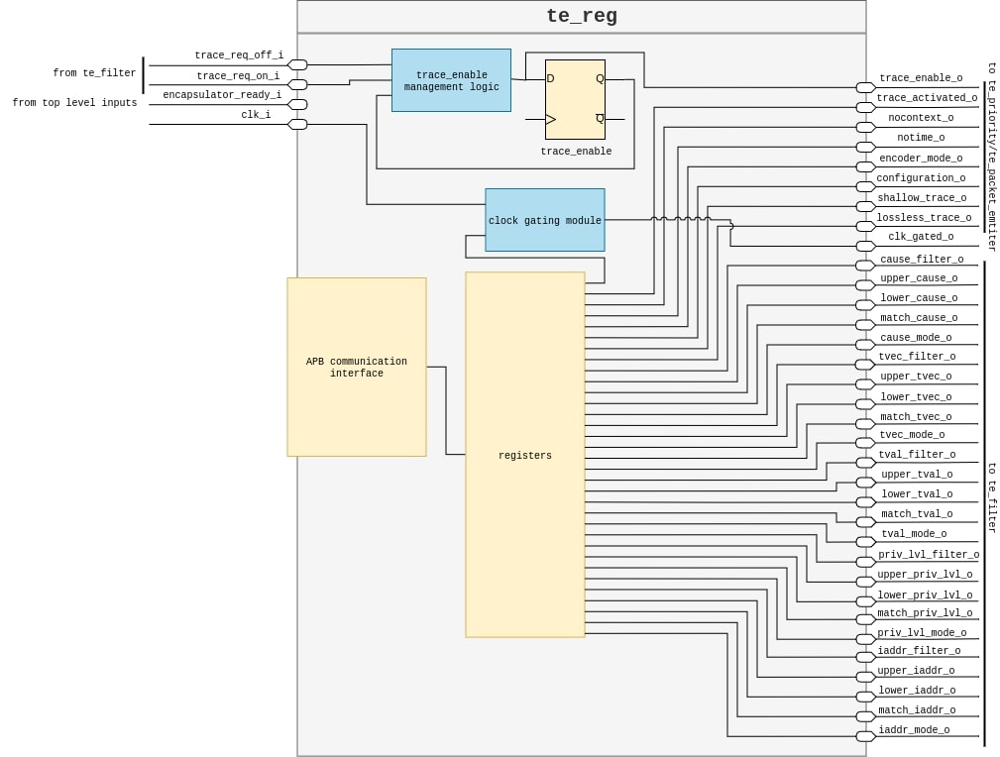
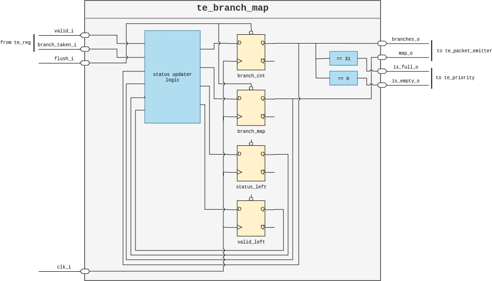
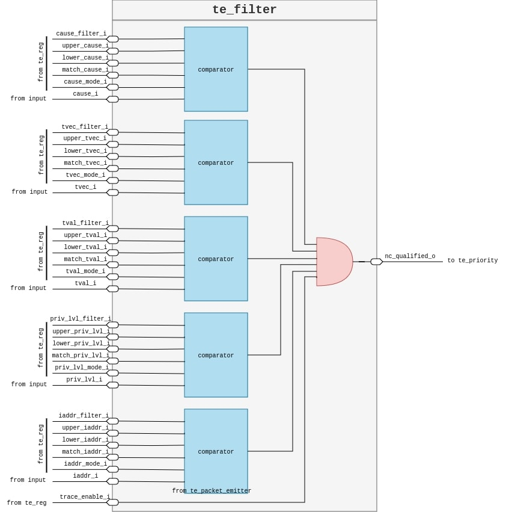
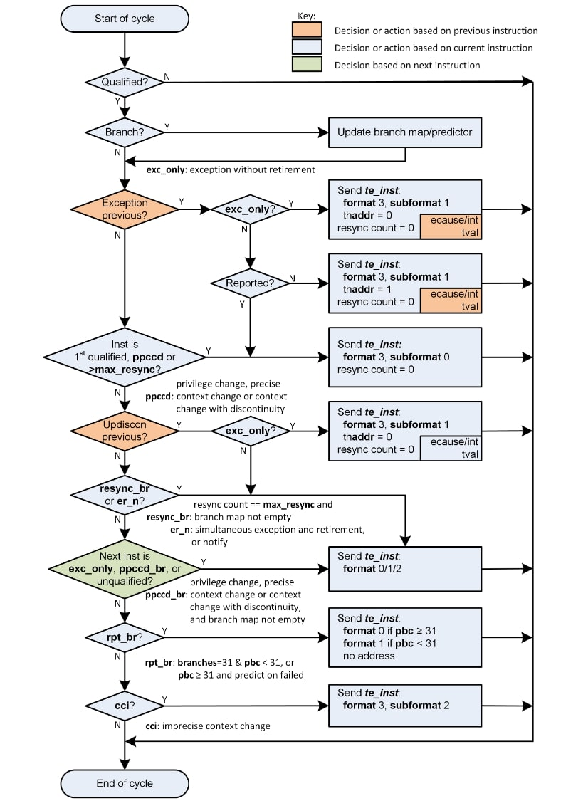
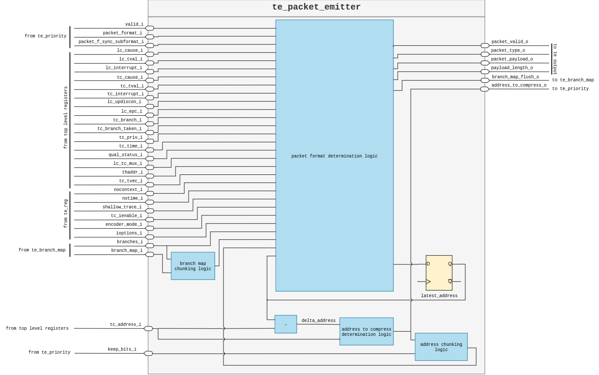
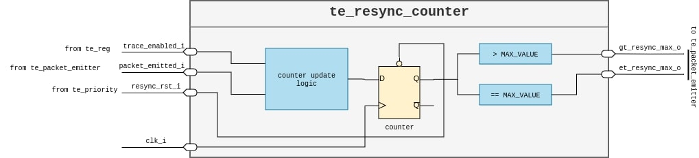
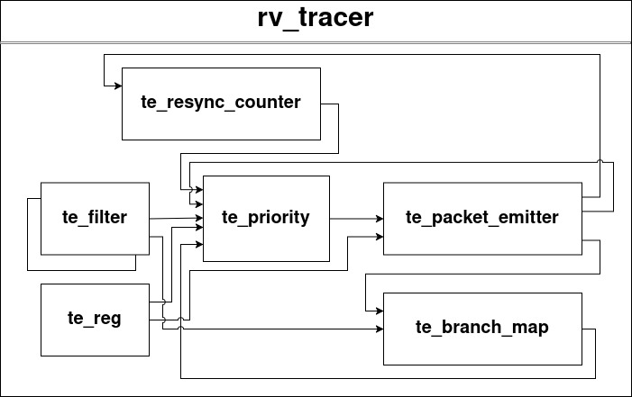
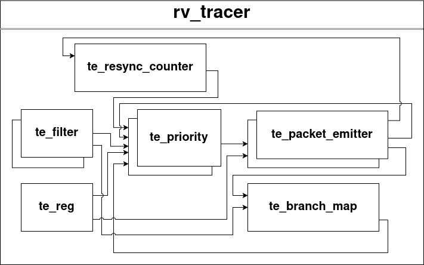

[comment]: <> (Author:  Umberto Laghi)
[comment]: <> (Contact: umberto.laghi2@unibo.it)
[comment]: <> (Github:  @ubolakes)
[comment]: <> (Author:  Simone Manoni)
[comment]: <> (Contact: s.manoni@unibo.it)
[comment]: <> (Github:  @smanoni)

# rv_tracer
[](LICENSE)

rv_tracer is developed as part of the PULP project, a joint effort between ETH Zurich and the University of Bologna.

---

# License

Unless specified otherwise in the respective file headers, all code checked into this repository is made available under a permissive license. All hardware sources and tool scripts are licensed under the Solderpad Hardware License 0.51 (see [`LICENSE`](LICENSE)) or compatible licenses, except for files contained in the `img` directory, which are licensed under the Creative Commons Attribution-NoDerivates 4.0 International license (CC BY-ND 4.0).  
The file `generate_do.py` is licensed under Apache 2.0 license.

---

# Short summary

<details open>
<summary><b>Supported features</b></summary>

<br>

<div align="center">

| Feature                                       | Implemented           |
| :-------------------------------------------: | :-------------------: |
| **Branch Trace**                              |                       |
| Delta address mode                            | :white_check_mark:    |
| Full address mode                             | :white_check_mark:    |
| Implicit exception mode                       | :x:                   |
| Sequentially inferable jump mode              | :x:                   |
| Implicit return mode                          | :x:                   |
| Branch prediction mode                        | :x:                   |
| Jump target cache mode                        | :x:                   |
| **Instruction Trace Interface**               |                       |
| Single-retirement                             | :white_check_mark:    |
| Multiple-retirement                           | :white_check_mark:    |
| Trigger unit                                  | :white_check_mark:    |
| **Data Trace**                                | :x:                   |
| **Instruction Trace Output Packets**          |                       |
| Time                                          | :x:                   |
| Context                                       | :x:                   |

</div>

</details>

---

<details>
<summary><b>Testing progress</b></summary>

<br>

<div align="center">

| Module                | Tested                                    |
| :-------------------: | :---------------------------------------: |
| rv_tracer             | :white_check_mark:                        |
| te_branch_map         | :white_check_mark:                        |
| te_filter             | :white_check_mark:                        |
| te_packet_emitter     | :white_check_mark: (no format 0 packets)  |
| te_priority           | :white_check_mark:                        |
| te_reg                | :white_check_mark:                        |
| te_resync_counter     | :white_check_mark:                        |

</div>

</details>

---

<details open>
<summary><b>How to run it</b></summary>

<br>

After downloading the repo, move inside the repo:

```
cd rv_tracer
```

Then run the simulation:

```
make run
```

Between one run and the other launch:

```
make clean
```

</details>

---

# Design

The modules defined are the following:

- *te_reg*: stores configuration data, produces clock signal for the other modules;
- *te_resync_counter*: counts packets emitted or clock cycles and asks for a resynchronization packet;
- *te_branch_map*: counts the branches and keeps track if they were taken or not;
- *te_filter*: declares input blocks as "qualified" - they can be processed by the next modules - based on user-defined values read from *te_reg*;
- *te_priority*: determines which packet needs to be emitted and performs a simple compression on the address that is put inside the payload;
- *te_packet_emitter*: populates the payload and can reset both the *te_resync_counter* and *te_branch_map*.

<div align="center">
<p style="background-color: white; padding: 10px;">

</p>

*Figure 1: high level rv_tracer architecture*

</div>

---

<details>
<summary><b>te_reg</b></summary>

This module stores the user and non-user definable parameters.

The user-definable parameters are the following:

- `trace_activated`
- `nocontext`
- `notime`
- `encoder_mode`
- `configuration`
- `lossless_trace`
- `shallow_trace`
- parameters necessary for the *te_filter* module

The `clock_gated` signal depends on the `trace_activated` signal.

<div align="center">
<p align="center" style="background-color: white; padding: 10px;">

</p>

*Figure 2: te_reg internal architecture*

</div>

### APB Protocol

To access the registers, an APB interface is required.

<div align="center">

| Signal Name | Source | Width | Description |
|:-----------:|:------:|:-----:|:-----------:|
| PCLK | Clock | 1 | Clock |
| PADDR | Requester | ADDR_WIDTH | Address |
| PSELx | Requester | 1 | Select |
| PENABLE | Requester | 1 | Enable |
| PWRITE | Requester | 1 | Direction |
| PWDATA | Requester | DATA_WIDTH | Write data |
| PREADY | Completer | 1 | Ready |
| PRDATA | Completer | DATA_WIDTH | Read data |

</div>

</details>

---

<details>
<summary><b>te_branch_map</b></summary>

The *te_branch_map* module keeps track of branches using a counter and a branch map.

<div align="center">
<p style="background-color: white; padding: 10px;">

</p>

*Figure 5: te_branch_map internal architecture*

</div>

</details>

---

<details>
<summary><b>te_filter</b></summary>

The *te_filter* filters input blocks to trace specific portions of code.

<div align="center">
<p style="background-color: white; padding: 10px;">

</p>

*Figure 6: te_filter internal architecture*

</div>

</details>

---

<details>
<summary><b>te_priority</b></summary>

Determines which packet needs to be emitted.

<div align="center">
<p style="background-color: white; padding: 10px;">

</p>

*Figure 7: flow chart determining packet type*

</div>

</details>

---

<details>
<summary><b>te_packet_emitter</b></summary>

The *te_packet_emitter* module populates the payload according to inputs from *te_priority*.

<div align="center">
<p style="background-color: white; padding: 10px;">

</p>

*Figure 11: te_packet_emitter internal architecture*

</div>

</details>

---

<details>
<summary><b>te_resync_counter</b></summary>

Counts emitted packets or elapsed clock cycles and signals when resynchronization is required.

<div align="center">
<p style="background-color: white; padding: 10px;">

</p>

*Figure 12: te_resync_counter internal architecture*

</div>

</details>

---

# Multiple Retirement Support

Many RISC-V cores can retire up to *N* instructions per cycle.

<details>
<summary><b>Multiple Retirement: Branches Only</b></summary>

<div align="center">
<p style="background-color: white; padding: 10px;">

</p>

*Figure 13: rv_tracer architecture for up to N branches in the same cycle*

</div>

</details>

---

<details>
<summary><b>Multiple Retirement: Not Only Branches</b></summary>

<div align="center">
<p style="background-color: white; padding: 10px;">

</p>

*Figure 14: rv_tracer architecture for up to N discontinuities in the same cycle*

</div>

</details>

---

# Cite this work

If you use `rv_tracer` in your research, please cite:

```bibtex
@article{laghi2025efficient,
  title={Efficient Trace for RISC-V: Design, Evaluation, and Integration in CVA6},
  author={Laghi, Umberto and Manoni, Simone and Parisi, Emanuele and Bartolini, Andrea},
  journal={arXiv preprint arXiv:2504.01972},
  year={2025}
}
```
