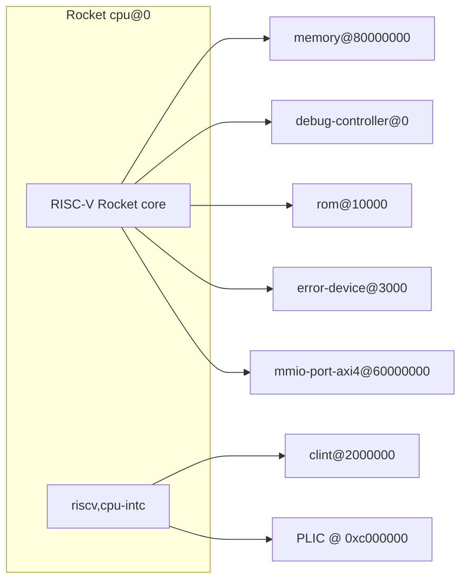

# Rocket Chip RTL Organization Documentation

[](https://github.com/chipsalliance/rocket-chip)
[](../../datasets/rocket-chip/8f1e33b2/manifest.json)
[](../../tools/rocket-chip/README.md)

This document provides comprehensive information about the Rocket Chip environment and generation scripts under `./scripts/`, the upstream generator in `tools/rocket-chip/`, and the structure of per-commit RTL benchmark datasets under `datasets/rocket-chip/<commit>/`. SCORE pins the submodule at `tools/rocket-chip` (see `.gitmodules`), runs Mill/Chisel elaboration through `generate_rocket_chip.sh`, relocates Mill `out/` and SBT `target/` into the dataset tree, and records manifests, logs, and syntax verification—unlike a minimal upstream clone where you would typically invoke `make`/`mill` directly and keep build products under the upstream tree.

## Table of Contents

- [Overview](#overview)
- [SoC architecture](#soc-architecture)
- [Licensing](#licensing)
- [Installation Script](#installation-script)
- [Generation Script](#generation-script)
- [Available Designs](#available-designs)
- [Output Organization](#output-organization)
- [Dataset Structure](#dataset-structure)
- [Usage Examples](#usage-examples)
- [Performance Expectations](#performance-expectations)
- [Troubleshooting](#troubleshooting)

## Overview

The Rocket Chip flow in SCORE installs a Java/Scala/Mill stack (and optional Verilator/FIRRTL-related tooling), initializes the `tools/rocket-chip` submodule, and generates a catalog of Chisel `Config` elaborations as Verilog (or FIRRTL) plus metadata, collected under `datasets/rocket-chip/<8-char-sha>/`. That directory is the canonical benchmark root: RTL, Mill outputs, logs, `manifest.json`, and `verification/` are co-located for reproducibility.

### Key Features

- **Submodule-driven upstream**: Rocket Chip is vendored at `tools/rocket-chip` per `.gitmodules` (`git@github.com:chipsalliance/rocket-chip.git`); install and run scripts can initialize submodules recursively.
- **Relocated build outputs**: `generate_rocket_chip.sh` symlinks `tools/rocket-chip/out` → `datasets/rocket-chip/<commit>/out` and `target` → `datasets/rocket-chip/<commit>/target` so large Mill artifacts stay out of the submodule working tree (see comments in `scripts/generate_rocket_chip.sh`).
- **Structured RTL dataset**: Designs are copied into `rtl_designs/<category>/<design_name>/` with `config_info.txt`, optional `*.dts`, `*.memmap.json`, `*.regmap.json`, FIRRTL/JSON collateral, and optional `*_tb.sv` placeholders.
- **Syntax verification**: By default, generated Verilog/SystemVerilog is checked with Verilator and Icarus Verilog; results roll up in `verification/verification_summary.txt`.
- **Benchmark manifest**: `manifest.json` records schema `score.benchmark_manifest.v1`, upstream commit, host, and tool version strings for the generation run.

### Scripts Overview

1. **`./scripts/install_rocket_chip.sh`**: OS-aware dependency installation (JDK 11, Scala, SBT, Mill, optional FIRRTL/Verilator), submodule init for `tools/rocket-chip`, and install logging under `datasets/rocket-chip/<sha>/logs/rocket_chip_install/` by default.
2. **`./scripts/generate_rocket_chip.sh`**: Prerequisite checks, Mill/Chisel generation for selected configuration categories, dataset layout, optional verification and testbenches, optional emulator or RISC-V smoke hooks when enabled and when external tools (`RISCV`, etc.) are present.
3. **`./scripts/run_rocket_chip.sh`**: End-to-end orchestration: submodule update → full install (Verilator on by default) → full generation; extra arguments after `--` pass through to `generate_rocket_chip.sh`.
4. **`source ./scripts/rocket_chip_env.sh`**: Preferred JDK 11 selection and PATH setup for Scala/SBT/Mill when installed locally; sourced automatically by `generate_rocket_chip.sh` when present.

### Architecture Overview

Rocket Chip is a Chisel-based **generator** for RISC-V systems: each `freechips.rocketchip.system.*Config` selects core, memory, and bus parameters. SCORE materializes a **finite set** of those configs as elaborated RTL and collateral for benchmarking and tooling studies. Block-level SoC detail for a representative config appears under [SoC architecture](#soc-architecture), grounded in dataset device trees and memory maps (example paths cite `datasets/rocket-chip/8f1e33b2/`).

## SoC architecture

The following reflects a **typical single-tile Rocket Chip subsystem** as emitted for configuration `rocket_b_ext` (`freechips.rocketchip.system.DefaultBConfig`), evidenced by `datasets/rocket-chip/8f1e33b2/rtl_designs/single_core/rocket_b_ext/freechips.rocketchip.system.DefaultBConfig.dts` and `...DefaultBConfig.memmap.json`. Other configs differ in core count, ports, and parameters; use each design’s own `*.dts` / `*.memmap.json` where present.

### Block-level structure

- **Rocket CPU**: `cpu@0` with `compatible = "sifive,rocket0", "riscv"`; caches, TLBs, and `riscv,cpu-intc` interrupt controller (from `*.dts`).
- **Main memory**: `memory@80000000` — `reg = <0x80000000 0x10000000>` (from `*.dts`).
- **CLINT**: `clint@2000000` — `compatible = "riscv,clint0"` (from `*.dts`).
- **PLIC**: `interrupt-controller@c000000` — `compatible = "riscv,plic0"` (from `*.dts`).
- **Debug**: `debug-controller@0` — `compatible = "sifive,debug-013", "riscv,debug-013"` (from `*.dts`).
- **ROM**: `rom@10000` — `compatible = "sifive,rom0"` (from `*.dts`).
- **Error device**: `error-device@3000` — `compatible = "sifive,error0"` (from `*.dts`).
- **MMIO / peripheral bus**: `mmio-port-axi4@60000000` with `compatible = "simple-bus"` and AXI4 address mapping `ranges = <0x60000000 0x60000000 0x20000000>` (from `*.dts`).

### Buses and connectivity

- The sample device tree names an **AXI4 MMIO port** (`mmio-port-axi4@60000000`) and a **simple-bus** SoC node (`compatible = "freechips,rocketchip-unknown-soc", "simple-bus"`). Further interconnect naming (e.g. TileLink) is not spelled out in the cited `*.dts` excerpt; see `TestHarness.fir` and upstream Rocket Chip documentation for generator-level connectivity.

### Memory map

Compact view from `freechips.rocketchip.system.DefaultBConfig.memmap.json` (bases in decimal; names from JSON):

| Region (base) | Size | Names (from JSON) |
|---------------|------|-------------------|
| 0 | 4096 | debug-controller@0 |
| 12288 | 4096 | error-device@3000 |
| 65536 | 65536 | rom@10000 |
| 33554432 | 65536 | clint@2000000 |
| 201326592 | 67108864 | interrupt-controller@c000000 |
| 1610612736 | 536870912 | mmio-port-axi4@60000000 |
| 2147483648 | 268435456 | memory@80000000 |

### Diagram (evidence-aligned)



## Licensing

- **`tools/rocket-chip/LICENSE.Berkeley`**: Regents of the University of California copyright; BSD-style redistribution terms (3-clause style as in the file).
- **`tools/rocket-chip/LICENSE.SiFive`**: **Apache License, Version 2.0** (January 2004), as stated in the file header.
- **`tools/rocket-chip/LICENSE.jtag`**: Chisel-JTAG terms; Regents copyright with BSD-style conditions (see file).
- **Submodules / dependencies**: Additional licenses appear under paths such as `tools/rocket-chip/dependencies/chisel/LICENSE`, `tools/rocket-chip/dependencies/cde/LICENSE`, and `tools/rocket-chip/dependencies/hardfloat/LICENSE`; see those files for exact terms.

RTL and collateral under `datasets/rocket-chip/<commit>/` are **generated artifacts** from the upstream-licensed sources; they do not introduce a separate SCORE license for the generated RTL.

## Installation Script

### Overview

`install_rocket_chip.sh` prepares the host for Rocket Chip builds: detects OS family (`/etc/os-release` and fallbacks), installs system packages when not skipped, installs or verifies OpenJDK 11, Scala, SBT, Mill, optional FIRRTL-related tooling, optionally Verilator, and initializes `tools/rocket-chip` and nested submodules when `.gitmodules` contains that path.

### Basic Usage

```bash
# First-time full install from SCORE repo root
./scripts/install_rocket_chip.sh

# Check what is already satisfied (no installs)
./scripts/install_rocket_chip.sh --check-only

# User-local tool install layout (per script help)
./scripts/install_rocket_chip.sh --local

# Include Verilator (optional component)
./scripts/install_rocket_chip.sh --verilator

# Skip network fetches where the script honors offline mode
./scripts/install_rocket_chip.sh --offline

# Skip apt/dnf/pacman/zypper — you must already have JDK and build tools
./scripts/install_rocket_chip.sh --no-system-deps

# Re-run installs even if versions appear present
./scripts/install_rocket_chip.sh --force

# Troubleshooting
./scripts/install_rocket_chip.sh --debug
```

### Command-Line Options

| Option | Description |
|--------|-------------|
| `-h, --help` | Show help message |
| `--check-only` | Only check environment status; do not install |
| `--debug` | Enable debug output |
| `--no-java` | Skip Java installation |
| `--no-scala` | Skip Scala installation |
| `--no-sbt` | Skip SBT installation |
| `--no-mill` | Skip Mill installation |
| `--no-firrtl` | Skip FIRRTL tools installation |
| `--verilator` | Install Verilator for simulation |
| `--force` | Force reinstall even if tools exist |
| `--offline` | Skip network-dependent installations |
| `--no-system-deps` | Skip system package-manager steps |
| `--local` | Install tools locally in user directory |

### Dependencies Installed

Versions below follow **`scripts/install_rocket_chip.sh`** variable pins and `--help` text. The **host that produced** `datasets/rocket-chip/8f1e33b2/manifest.json` recorded the versions in that manifest for Java, Mill, Verilator, and firtool (which may differ slightly if the OS package manager supplied a newer Verilator, for example).

| Component | Version (install script target) | Purpose |
|-----------|----------------------------------|---------|
| OpenJDK | 11 (`JAVA_VERSION` in script) | JVM for Scala/Mill |
| Scala | 2.13.12 | Language runtime |
| SBT | 1.9.6 | Alternate build tool (upstream ecosystem) |
| Mill | 0.11.5 | Primary Rocket Chip build driver in SCORE flow |
| Verilator | 5.006 (when `--verilator`) | Simulation / lint |
| FIRRTL tools | Optional (`INSTALL_FIRRTL`) | FIRRTL processing when installed |

### Supported Operating Systems

The installer maps hosts to families including **macOS**, **Ubuntu/Debian-like**, **Fedora**, **RHEL/Rocky/Alma-like**, **Amazon Linux**, **Arch**, **openSUSE**, and generic **Linux** fallbacks, driven by `detect_os()` in `install_rocket_chip.sh`.

### Installation Process

1. Normalize options and create the install log directory (default under `datasets/rocket-chip/<short-sha>/logs/rocket_chip_install/` unless `ROCKET_CHIP_INSTALL_LOG_DIR` overrides).
2. Detect OS family and select package manager commands (`apt-get`, `dnf`/`yum`, `pacman`, `zypper`, or macOS `brew` where applicable).
3. Unless `--check-only` or submodule path missing: run `git submodule update --init --recursive tools/rocket-chip` from the SCORE root when `.gitmodules` lists it, then nested submodules inside `tools/rocket-chip`.
4. Install or verify OpenJDK 11, then Scala/SBT/Mill (either system-wide or user-local depending on `--local` / `--no-system-deps` branches).
5. Optionally install FIRRTL-related tools and Verilator when flags request them.
6. Emit success/warning messages to the console and the dated install log file.

### Usage Examples

```bash
# After install, generation sources this when present
source ./scripts/rocket_chip_env.sh

# Same as --no-system-deps (documented in --help)
ROCKET_CHIP_SKIP_SYSTEM_DEPS=1 ./scripts/install_rocket_chip.sh
```

## Generation Script

### Overview

`generate_rocket_chip.sh` runs from the SCORE repository root, sources `rocket_chip_env.sh` and optionally `setup_local_env.sh`, ensures Mill output directories are symlinked into `datasets/rocket-chip/<commit>/`, elaborates selected Rocket Chip configurations via Mill, copies RTL and metadata into `rtl_designs/`, runs optional Verilator/Icarus syntax checks, writes `rocket_chip_summary.txt` and `manifest.json`, and produces per-config logs under `logs/` and `verification/`.

### Basic Usage

```bash
# Default generation set (per script defaults) with verification
./scripts/generate_rocket_chip.sh

# Preview planned work only
./scripts/generate_rocket_chip.sh --dry-run

# More parallelism (script caps at 32 jobs)
./scripts/generate_rocket_chip.sh --jobs 8 --verbose

# Re-run verification only on existing RTL
./scripts/generate_rocket_chip.sh --verify-only

# Generate RTL but skip verification and summary stages
./scripts/generate_rocket_chip.sh --compile-only

# First-time helper: script offers --setup to install missing tools (e.g. firtool guidance)
./scripts/generate_rocket_chip.sh --setup

# Optional smoke paths (need extra toolchain / RISCV — see --help)
./scripts/generate_rocket_chip.sh --emulator-elf-smoke
./scripts/generate_rocket_chip.sh --riscv-isa-smoke
./scripts/generate_rocket_chip.sh --mill-riscv-test-smoke
```

### Configuration Options

| Option | Description | Default |
|--------|-------------|---------|
| `--single-core` / `--no-single-core` | Enable/disable single-core configurations | enabled (`true`) |
| `--dual-core` / `--no-dual-core` | Enable/disable dual-related multi configs | enabled (`true`) |
| `--quad-core` / `--no-quad-core` | Enable/disable quad-core set | enabled (`true`) |
| `--cluster` / `--no-cluster` | Enable/disable cluster configurations | disabled (`false`) |
| `--tiny` / `--no-tiny` | Enable/disable tiny core configurations | enabled (`true`) |
| `--fpga` / `--no-fpga` | Enable/disable FPGA-oriented configurations | enabled (`true`) |

### Generation Options

| Option | Description | Default |
|--------|-------------|---------|
| `--verify` / `--no-verify` / `--skip-verify` | Control syntax verification | verify enabled (`true`) |
| `--verify-only` | Only verify existing RTL | `false` |
| `--emulator-elf-smoke` | Build/run Mill `emulator[...].elf` per config | `false` |
| `--riscv-isa-smoke` | Emulator + one `riscv-tests` ELF after run | `false` |
| `--mill-riscv-test-smoke` | One Mill `runnable-riscv-test` invocation | `false` |
| `--testbench` / `--no-testbench` | Placeholder testbenches | enabled (`true`) |
| `--compile-only` | Compile only; skip verification and summary | `false` |
| `--format FORMAT` | `verilog`, `firrtl`, or `both` | `verilog` |

### Setup Options

| Option | Description | Default |
|--------|-------------|---------|
| `--setup` | Automatically download/install required tools (see script messages) | off unless passed |

### Execution Options

| Option | Description | Default |
|--------|-------------|---------|
| `-j, --jobs N` | Parallel jobs (capped at 32 in script) | `4` |
| `--dry-run` | Show what would run without doing it | `false` |
| `--verbose` | Verbose logging | `false` |
| `-h, --help` | Show help | — |

Environment variables referenced in `--help` include `RISCV`, `RISCV_TESTS_ROOT`, `ROCKET_ISA_SMOKE_CONFIG`, `ROCKET_ISA_SMOKE_ELF`, `ROCKET_ISA_MAX_CYCLES`, `ROCKET_MILL_RISCV_CONFIG`, `ROCKET_MILL_OUT`, `ROCKET_SBT_TARGET_DIR`, `ROCKET_CHIP_LOG_DIR`, and `SCORE_SKIP_ROOT_OUT_CLEANUP`.

### Generation Process

1. Source environment scripts and compute `DATASET_DIR` from the short submodule commit.
2. `ensure_rocket_chip_build_layout`: create dataset `out/` and `target/`, set `MILL_OUTPUT_DIR`, symlink from `tools/rocket-chip/out` and `target`.
3. `cleanup_stale_project_root_mill_out`: remove accidental Mill output under the SCORE repo root when it matches Mill artifacts (unless `SCORE_SKIP_ROOT_OUT_CLEANUP` is set).
4. Check prerequisites: `tools/rocket-chip` present, `java` on `PATH`, `mill`, optional `firtool`, and Java major version ≥ 11.
5. For each selected configuration category, invoke Mill targets (as summarized in each design’s `config_info.txt`: `mfccompiler.compile`, `generator.elaborate`, `generator.chirrtl`, etc.).
6. Copy elaborated RTL and collateral into `rtl_designs/<category>/<name>/`.
7. If verification is enabled, run Verilator and Icarus on the generated Verilog/SystemVerilog and write `verification/*.log`.
8. Write `rocket_chip_summary.txt`, `manifest.json`, and generation logs under `logs/`.

### Advanced Usage Examples

```bash
# Single-core, edge, and special only (dual/quad multi configs off)
./scripts/generate_rocket_chip.sh --no-dual-core --no-quad-core

# Through run_rocket_chip.sh with extra generator flags
./scripts/run_rocket_chip.sh -- --jobs 2 --verify-only
```

## Available Designs

Per `datasets/rocket-chip/8f1e33b2/rocket_chip_summary.txt`, this commit contains **19** configurations in **four** categories (**95** RTL files, **verilog** output). The `generate_rocket_chip.sh --help` text also lists **fpga** and **benchmark** as category names; under commit `8f1e33b2` the `rtl_designs/` tree contains **`single_core/`**, **`multi_core/`**, **`edge_config/`**, and **`special/`** only—no `fpga/` or `benchmark/` directories. Prefer the on-disk layout when they disagree with the help text’s high-level list.

### 1. Single-core designs (`rtl_designs/single_core/`)

| Design name | Rocket Chip class | Notes |
|-------------|-------------------|--------|
| `rocket_b_ext` | `freechips.rocketchip.system.DefaultBConfig` | Bit-manipulation-oriented config name |
| `rocket_big` | `freechips.rocketchip.system.DefaultConfig` | “Default” large core config |
| `rocket_fp16` | `freechips.rocketchip.system.DefaultFP16Config` | FP16-related parameters |
| `rocket_hypervisor` | `freechips.rocketchip.system.HypervisorConfig` | Hypervisor support |
| `rocket_rv32` | `freechips.rocketchip.system.DefaultRV32Config` | RV32 variant |
| `rocket_rv32_b` | `freechips.rocketchip.system.DefaultRV32BConfig` | RV32 + B extension |
| `rocket_small` | `freechips.rocketchip.system.DefaultSmallConfig` | Small core |
| `rocket_tiny` | `freechips.rocketchip.system.TinyConfig` | Tiny core |

### 2. Multi-core / multi-channel designs (`rtl_designs/multi_core/`)

| Design name | Rocket Chip class |
|-------------|-------------------|
| `rocket_dual_bank` | `freechips.rocketchip.system.DualBankConfig` |
| `rocket_dual_channel` | `freechips.rocketchip.system.DualChannelConfig` |
| `rocket_dual_channel_dual_bank` | `freechips.rocketchip.system.DualChannelDualBankConfig` |
| `rocket_dual_core` | `freechips.rocketchip.system.DualCoreConfig` |
| `rocket_eight_channel` | `freechips.rocketchip.system.EightChannelConfig` |

### 3. Edge configurations (`rtl_designs/edge_config/`)

| Design name | Rocket Chip class |
|-------------|-------------------|
| `rocket_edge_32bit` | `freechips.rocketchip.system.Edge32BitConfig` |
| `rocket_edge_128bit` | `freechips.rocketchip.system.Edge128BitConfig` |

### 4. Special configurations (`rtl_designs/special/`)

| Design name | Rocket Chip class |
|-------------|-------------------|
| `rocket_clone_tile` | `freechips.rocketchip.system.CloneTileConfig` |
| `rocket_mem_port_only` | `freechips.rocketchip.system.MemPortOnlyConfig` |
| `rocket_mmio_port_only` | `freechips.rocketchip.system.MMIOPortOnlyConfig` |
| `rocket_rocc_example` | `freechips.rocketchip.system.RoccExampleConfig` |

**Common features (from `config_info.txt` samples):** Chisel/FIRRTL generation via Mill; each sampled config lists `Build Method: Multiple mill targets (mfccompiler.compile, generator.elaborate, generator.chirrtl)` and `Generator: Rocket Chip Generator (Chisel/FIRRTL)`.

## Output Organization

Canonical dataset root:

```text
datasets/rocket-chip/<8-character-upstream-commit>/
```

Example layout for commit **`8f1e33b2`** (from repository listing):

```text
datasets/rocket-chip/8f1e33b2/
├── manifest.json              # Benchmark manifest (schema, commit, host, tool_versions)
├── rocket_chip_summary.txt    # Human-readable index and generation options
├── logs/                      # Generation and install logs
│   └── rocket_chip_install/   # install_rocket_chip.sh logs (default location)
├── out/                       # Mill output (tools/rocket-chip/out → symlink here)
├── target/                    # Optional SBT target/ symlink destination
├── rtl_designs/               # Per-design RTL + metadata (by category)
├── verification/              # Syntax logs + verification_summary.txt
```

## Dataset Structure

- **`manifest.json`**: `score.benchmark_manifest.v1` metadata including `upstream_commit`, `generated_utc`, `host`, and `tool_versions` (see `datasets/rocket-chip/8f1e33b2/manifest.json`).
- **`rocket_chip_summary.txt`**: Category counts, design-to-class mapping, and generation flags used for that run.
- **`rtl_designs/**`**: Verilog modules (`.v`), optional SystemVerilog (`*.sv`), FIRRTL (`TestHarness.fir`), annotation/JSON (`*.anno.json`, `elaborate.json`, `chiselAnno.json`, `chirrtl.json`), optional graph (`*.graphml`), `config_info.txt`, device tree (`*.dts`), memory map (`*.memmap.json`), register maps (`*.regmap.json`), and optional `*_tb.sv` placeholders (see `rocket_chip_summary.txt`: placeholders do not instantiate `TestHarness`).
- **`verification/`**: Per-design `*_syntax.log`, file lists, and `verification_summary.txt`. For `8f1e33b2`: 19 configurations verified, 0 syntax errors, Verilator and Icarus both used (per `verification_summary.txt`).

### Integration with EDA tools

The dataset is intended as **synthesizable RTL and metadata** for downstream flows; specific proprietary tool scripts are outside SCORE unless added under `scripts/`. Use your own synthesis/simulation environment with the generated Verilog top modules and accompanying collateral.

## Usage Examples

```bash
# One-shot pipeline (submodule + install + generate)
./scripts/run_rocket_chip.sh

# Install without Verilator, then generate with 2 jobs
./scripts/run_rocket_chip.sh --no-verilator -- --jobs 2

# Manual path: env + install + generate
source ./scripts/rocket_chip_env.sh
./scripts/install_rocket_chip.sh --verilator
./scripts/generate_rocket_chip.sh --jobs 4

# Submodule refresh if upstream pointers changed
git submodule update --init --recursive tools/rocket-chip
```

## Performance Expectations

- **Time and CPU**: Full multi-config elaboration is dominated by **JVM + Mill/Chisel** compilation and repeated elaboration; use `--jobs` to scale parallelism within the script’s cap (32).
- **Disk**: Mill `out/` under `datasets/rocket-chip/<commit>/out` can grow large; keeping it under the dataset path avoids bloating `tools/rocket-chip`.
- **RAM**: Chisel elaboration benefits from ample heap; adjust `JAVA_OPTS` in your environment if you observe OOM errors (not measured in SCORE logs for this README).

No wall-clock benchmark table is recorded here; add timings only if you capture them from your own `logs/*.log` runs.

## Troubleshooting

| Symptom | Likely cause | What to try |
|---------|----------------|------------|
| `Rocket Chip directory not found` | Submodule not initialized | `git submodule update --init --recursive tools/rocket-chip` (also done by install/run scripts when configured) |
| Java errors / wrong JDK | JDK 8 on `PATH` or missing JDK 11 | `source ./scripts/rocket_chip_env.sh` then verify `java -version`; install OpenJDK 11 per `install_rocket_chip.sh` |
| `mill: command not found` | Mill not installed or not on `PATH` | `./scripts/install_rocket_chip.sh` or `./scripts/install_rocket_chip.sh --local` |
| Stray `out/` at repo root | Mill invoked from wrong cwd earlier | Re-run `./scripts/generate_rocket_chip.sh` (it cleans Mill-shaped `out/` at repo root unless `SCORE_SKIP_ROOT_OUT_CLEANUP` is set) |
| Emulator / ISA smoke failures | Missing `RISCV`, clang, ninja, or tests | See `./scripts/install_rocket_chip.sh --help` “For generate_rocket_chip.sh --emulator-elf-smoke” and `./scripts/generate_rocket_chip.sh --help` environment section |
| Syntax verification disagrees with expectations | Tool version drift | Compare `manifest.json` `tool_versions` with local `verilator --version` / `iverilog -V` |

Verify manually after upstream or script changes:

```bash
./scripts/install_rocket_chip.sh --help
./scripts/generate_rocket_chip.sh --help
```
